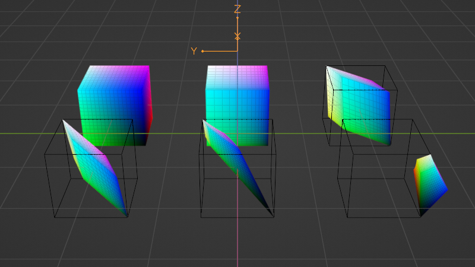

# 3D Colour Space
Show colour spaces as a 3d object .obj file

<!-- https://convertio.co -->

## Coordinates Representation [^1]

| Colour Space | X | Y | Z |
| --- | --- | --- | --- |
| sRGB | R | G | B |
| Linear RGB | R | G | B |
| CIE XYZ | X | Y | Z |
| Linear LMS | L | M | S |
| LMS | L | M | S |
| OkLab [^2] | a | b | L |

## Minimum & Maximum Values [^3]

| CIE XYZ | Min | Max |
|---|---|---|
| X | 0.000000 | 1.000000 |
| Y | 0.000000 | 1.000000 |
| Z | 0.000000 | 1.000000 |

| Linear LMS | Min | Max |
|---|---|---|
| L | 0.000000 | 1.000000 |
| M | 0.000000 | 1.000000 |
| S | 0.000000 | 1.000000 |

| LMS | Min | Max |
|---|---|---|
| L | 0.000000 | 1.000000 |
| M | 0.000000 | 1.000000 |
| S | 0.000000 | 1.000000 |

| OkLab | Min | Max |
|---|---|---|
| L     |  0.000000 | 1.000000 |
| a[^4] | -0.233951 | 0.276214 |
| b[^4] | -0.311762 | 0.198363 |

### OkLab Colours at Minimums & Maximums

| Value | Min | Max |
|---|---|---|
| L |  `#000000` |  `#FFFFFF` |
| a |  `#00FF00` |  `#FF00E0` |
| b |  `#0000FF` |  `#FFFF00` |

[^1]: Blender Import/Export Settings: +Y Forward & +Z Up
[^2]: Coordinates changed so L value is up
[^3]: Some calculations may be due to floating point errors - code uses double
[^4]: Generally, a value between [-0.4 and 0.4](https://bit.ly/3VJBNl6) is accepted